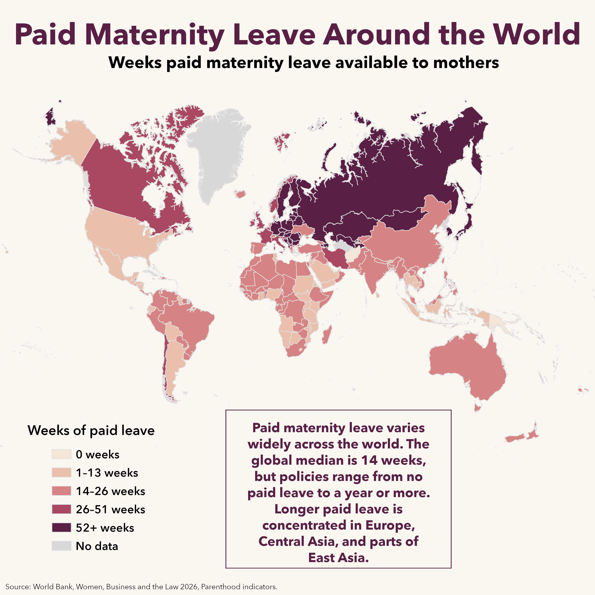

# Paid Maternity Leave Around the World

A Mother’s Day data visualization project mapping paid maternity leave available to mothers around the world.

The map uses World Bank Women, Business and the Law 2026 Parenthood indicators and visualizes paid maternity leave in weekly categories across 190 economies.

## Final Map

## Interactive Version

Explore the interactive ArcGIS Online version here:

[Interactive Map](https://bcitgis.maps.arcgis.com/apps/instant/basic/index.html?appid=c24b6c89680b4f068c252a85c47d97d3)

## Key Takeaways

- The global median paid maternity leave is 14 weeks.
- Six economies provide 0 weeks of paid maternity leave.
- Twenty-nine economies offer a year or more.
- Longer paid maternity leave is especially concentrated in Europe, Central Asia, and parts of East Asia.

## Data Source

This project uses data from the World Bank Women, Business and the Law 2026 Parenthood indicators.

- Dataset: World Bank Women, Business and the Law data, available through the World Bank Data360 platform.
- Report: *Women, Business and the Law 2026: Benchmarking Laws for Jobs and Inclusive Growth*, World Bank.

Data source links:

- Women, Business and the Law dataset: `https://data360.worldbank.org/en/dataset/WB_WBL`
- Women, Business and the Law 2026 report: `https://openknowledge.worldbank.org/entities/publication/78a9d749-20a5-44e3-afd1-1d9d6dcbd581`

The cleaned CSV in this repository is derived from the Parenthood section of the World Bank Women, Business and the Law 2026 data.

## Files

Recommended repository structure:

- `data/cleaned/WBL2026_Maternity_Leave_ArcGIS.csv`  
  Cleaned dataset used for mapping.

- `outputs/Paid_Maternity_Leave_Around_the_World.png`  
  Final static infographic.

- `notes/ArcGIS_Join_Notes_WBL2026_Maternity_Leave.txt`  
  Short notes on the GIS join and mapped field.

## Main Field Mapped

The main mapped field is:

`MAT_CLASS_WEEKS`

Classes used:

| Class | Description |
|---|---|
| `0 weeks` | No paid maternity leave |
| `1–13 weeks` | Less than 14 weeks |
| `14–26 weeks` | 14 to 26 weeks |
| `26–51 weeks` | 26 to 51 weeks |
| `52+ weeks` | One year or more |

## Notes and Limitations

This map shows paid maternity leave available to mothers. It does not represent total parental leave, unpaid leave, wage replacement rates, eligibility requirements, enforcement, or actual uptake.

The World Bank Women, Business and the Law dataset uses the term “economies,” which may include areas that do not correspond exactly to sovereign countries in all mapping datasets.

## Tools Used

- ArcGIS Pro
- ArcGIS Online / Instant Apps
- World Bank Women, Business and the Law 2026 data

## Author

Created by Yusuf Ali.

Connect with me on LinkedIn: [https://www.linkedin.com/in/yusuf-ali-b4aa732b1/]
