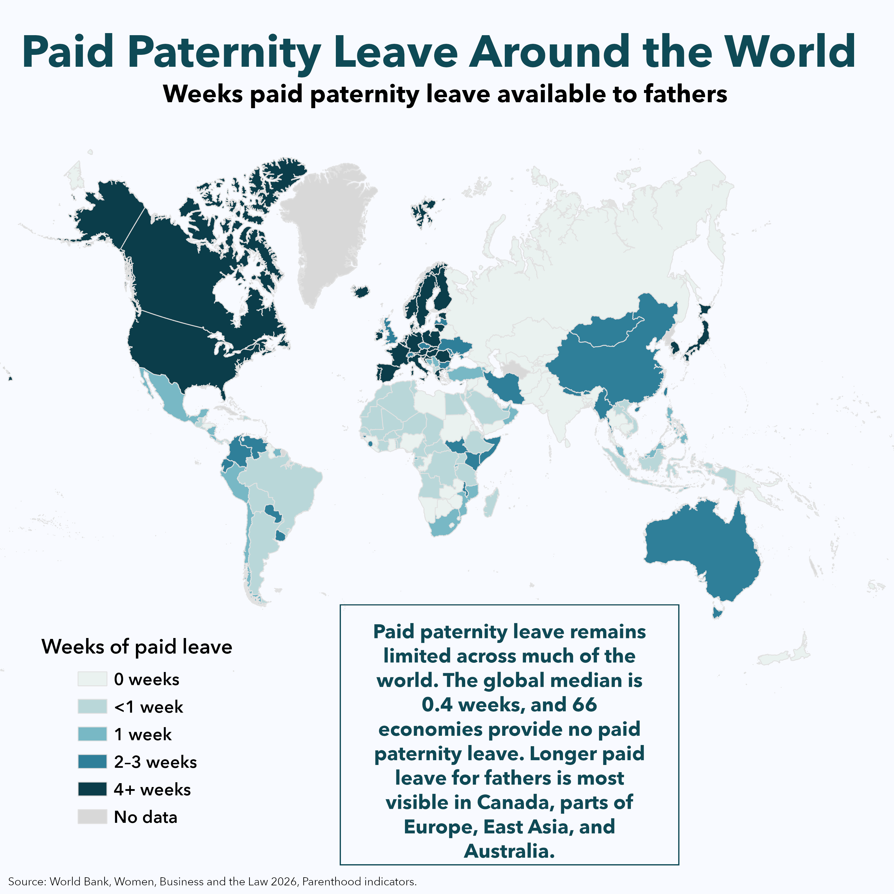
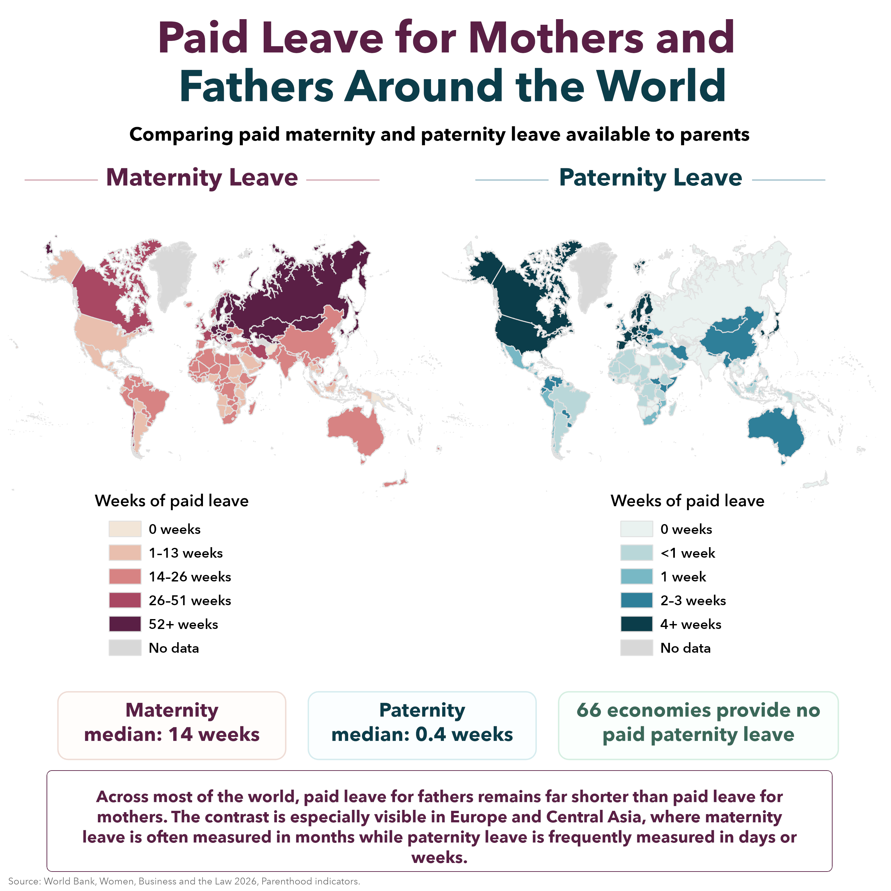

# Paid Maternity and Paternity Leave Around the World

A Mother’s Day and Father’s Day data visualization project mapping paid maternity and paternity leave around the world.

The project uses World Bank Women, Business and the Law 2026 Parenthood indicators to compare paid leave available to mothers and fathers across 190 economies.

## Final Maps

### Paid Maternity Leave Around the World

### Paid Paternity Leave Around the World

### Mothers and Fathers Comparison

## Interactive Version

Explore the interactive ArcGIS Online version here:

[Interactive Map](https://yusufali.maps.arcgis.com/apps/instant/basic/index.html?appid=74b4aad55b9a478088ed3a5976dc81b8)

## Key Takeaways

* The global median paid maternity leave is 14 weeks.
* The global median paid paternity leave is 0.4 weeks.
* Six economies provide 0 weeks of paid maternity leave.
* Sixty-six economies provide 0 weeks of paid paternity leave.
* Twenty-nine economies offer a year or more of paid maternity leave.
* Paid leave for fathers remains much shorter than paid leave for mothers across most of the world.
* Longer paid maternity leave is especially concentrated in Europe, Central Asia, and parts of East Asia.
* Longer paid paternity leave is most visible in Canada, parts of Europe, East Asia, and Australia.

## Data Source

This project uses data from the World Bank Women, Business and the Law 2026 Parenthood indicators.

* Dataset: World Bank Women, Business and the Law data, available through the World Bank Data360 platform.
* Report: *Women, Business and the Law 2026: Benchmarking Laws for Jobs and Inclusive Growth*, World Bank.

Data source links:

* Women, Business and the Law dataset: `https://data360.worldbank.org/en/dataset/WB_WBL`
* Women, Business and the Law 2026 report: `https://openknowledge.worldbank.org/entities/publication/78a9d749-20a5-44e3-afd1-1d9d6dcbd581`

The cleaned CSV files in this repository are derived from the Parenthood section of the World Bank Women, Business and the Law 2026 data.

## Files

Recommended repository structure:

* `data/cleaned/WBL2026_Maternity_Leave_ArcGIS.csv`
  Cleaned maternity leave dataset used for mapping.

* `data/cleaned/WBL2026_Paternity_Leave_ArcGIS.csv`
  Cleaned paternity leave dataset used for mapping.

* `outputs/Paid_Maternity_Leave_Around_the_World.png`
  Final standalone maternity leave infographic.

* `outputs/Paid_Paternity_Leave_Around_the_World.png`
  Final standalone paternity leave infographic.

* `outputs/Paid_Leave_Mothers_Fathers_Around_the_World.png`
  Final comparison infographic showing maternity and paternity leave side by side.

* `notes/ArcGIS_Join_Notes_WBL2026_Maternity_Leave.txt`
  Short notes on the maternity leave GIS join and mapped field.

* `notes/ArcGIS_Join_Notes_WBL2026_Paternity_Leave.txt`
  Short notes on the paternity leave GIS join and mapped field.

## Main Fields Mapped

### Maternity Leave

The main maternity leave field mapped is:

`MAT_CLASS_WEEKS`

Classes used:

| Class         | Description             |
| ------------- | ----------------------- |
| `0 weeks`     | No paid maternity leave |
| `1–13 weeks`  | Less than 14 weeks      |
| `14–26 weeks` | 14 to 26 weeks          |
| `26–51 weeks` | 26 to 51 weeks          |
| `52+ weeks`   | One year or more        |

### Paternity Leave

The main paternity leave field mapped is:

`PAT_CLASS_WEEKS`

Classes used:

| Class       | Description             |
| ----------- | ----------------------- |
| `0 weeks`   | No paid paternity leave |
| `<1 week`   | Less than one week      |
| `1 week`    | About one week          |
| `2–3 weeks` | Two to three weeks      |
| `4+ weeks`  | Four weeks or more      |

## Notes and Limitations

These maps show paid maternity leave available to mothers and paid paternity leave available to fathers. They do not represent total parental leave, shared parental leave, unpaid leave, wage replacement rates, eligibility requirements, enforcement, or actual uptake.

The maternity and paternity maps use different class breaks because paid maternity leave is generally measured in weeks or months, while paid paternity leave is often measured in days or weeks.

The World Bank Women, Business and the Law dataset uses the term “economies,” which may include areas that do not correspond exactly to sovereign countries in all mapping datasets.

## Tools Used

* ArcGIS Pro
* ArcGIS Online / Instant Apps
* World Bank Women, Business and the Law 2026 data

## Author

Created by Yusuf Ali.

Connect with me on LinkedIn: [Yusuf Ali](https://www.linkedin.com/in/yusuf-ali-b4aa732b1/)
